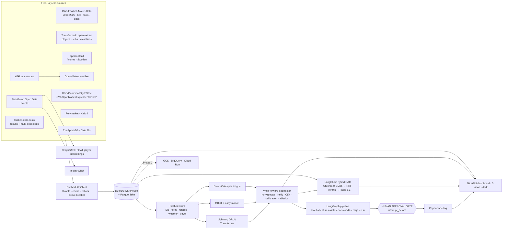

# PITCH-EDGE

[](https://github.com/hampusstalhandske/pitch-edge/actions/workflows/ci.yml)

**An agentic football (soccer) intelligence & market-edge research platform.** It ingests ~240k matches,
~2 M odds quotes and 7 M player-level rows from free, ToS-clean sources, models them with classical and
deep-learning methods, compares its own probabilities to bookmaker and prediction-market prices, and
**surfaces — never places —** signals behind walk-forward, closing-line-value backtests, in a dark-mode
five-view dashboard (NiceGUI) with a grounded RAG explainer (Claude Fable 5.1).

> **Hard guardrails.** No automated bet placement under any flag. No real-money movement. No scraping of any
> source whose robots.txt or ToS forbids it (Understat, FotMob, Sofascore, Flashscore are excluded for exactly
> that reason). Every number on the dashboard traces back to a walk-forward backtest at real, vig-inclusive prices.

```bash
uv sync --extra dev            # Python 3.11; torch, torch-geometric, lightning, langchain, chromadb, langgraph, nicegui …
uv run pitch-edge serve        # dark-mode dashboard on :8501 (data is already on disk after a refresh)
uv run pitch-edge refresh      # ingest → features → backtests → RAG index → artifacts (first run: 30–90 min)
uv run pytest                  # 233 unit + integration tests, all network mocked
```

No API keys are needed for anything above. Optional keys (API-Football, The Odds API, Everysport, Anthropic)
are documented in **`API_KEYS.md`**; `uv run pitch-edge setup` walks through them (asks, never blocks, writes a
git-ignored `.env`, never echoes a value). `uv sync --extra cloud` adds the GCS/BigQuery mirror.

```bash
uv run pitch-edge intel Brighton Forest              # pre-match dossier for the next meeting (or --date YYYY-MM-DD)
uv run pitch-edge setup                              # guided onboarding for the optional keys
uv run pitch-edge lead-lag && uv run pitch-edge referee-study   # the two Phase-5 stat-arb tests on stored data
```

---

## State of the project (2026-09-06)

| Area | Status |
|---|---|
| Data | 239,476 matches · 41 divisions · 27 countries · 1,267 teams · 1.97 M odds rows · 7.1 M Transfermarkt rows (1.89 M appearances, 631 k substitutions, 656 k valuations) · 149 StatsBomb matches with events · 622 Swedish results · 1,358 prediction-market rows (Kalshi + Polymarket) · 361 news items (EN + SV) · 165 geocoded grounds · 14 k kickoff-weather rows · 1.34 M daily Wikipedia pageview rows for 340 clubs (2015-07 →) |
| Models | Dixon-Coles (per league) · GBDT ± market · Lightning GRU · Lightning Transformer · GraphSAGE/GAT player embeddings (held-out-edge AUROC reported) · in-play GRU |
| Backtests | walk-forward, isotonic-calibrated, ¼/½-Kelly + flat, CLV-ready; `main` (11 European divisions, 2015→) and `developing` (16 under-covered leagues, 2013→) slices; feature-group ablation |
| RAG | LangChain hybrid retrieval (Chroma dense ∪ BM25, RRF, cross-encoder rerank) over 10.5 k docs · hit@1 0.99 / MRR 0.99 on synthetic QA · Claude Fable 5.1 generation with citation verification, template fallback offline |
| Agents | LangGraph pipeline with a structural human-approval interrupt; risk manager (fractional Kelly, per-bet/match/day caps, drawdown breaker); paper-trade log |
| Dashboard | NiceGUI (Python-native, FastAPI + Vue/Quasar), five views — Overview, Data universe, Backtest & calibration, Suggestions & approval, Ask the system — dark validated palette, one Plotly template, short-lived read-only warehouse connections |
| Quality | 233 tests · ruff · mypy clean · CI workflow · pre-commit |
| Known gaps | football-data.co.uk & Club Elo were 503/502 for the whole build (a watcher re-ingests on return → real early/closing Pinnacle prices, referee names, Swedish odds); no live odds feed without a key; stadium audio and charter tracking are stubs |

**Headline result (honest):** on public data alone every model is *less* informative than the closing price
(best: GBDT + market, −0.024 bits/match; Dixon-Coles −0.053; Lightning GRU −0.097 and Transformer −0.090 on the
2018→ slice; developing markets are further behind, not closer). Elo is the only feature group that clearly
matters; weather slightly hurts; the deep models trail the trees. Details, including the losers and one
documented training bug, in `CASE_STUDY.md`, `MODEL_CARDS.md` and `reports/*/REPORT.md`.

## Match Intel — the pre-match dossier (Phase 5)

`pitch-edge intel <home> <away> [--date …]` turns any fixture — played,
scheduled, or typed in — into a nine-section dossier: **the number** (a walk-forward prediction from a backtest
fold, or a prediction fitted at dossier time and *labelled raw*, always next to the backtest evidence for that
model, the per-league gap to the closing price, an empirical calibration band and the model card) · **form &
strength** (Elo trend, rolling form, Dixon-Coles attack/defence, head-to-head, home/away split) · **who's
actually playing** (confirmed XI with an API-Football key; otherwise the last XI used, from Transfermarkt,
marked *PROVISIONAL*, plus rotation load across all competitions) · **the referee** (assignment if announced,
tendency z-scores) · **conditions** (rest, congestion, travel, archive weather or a forecast) · **market
behaviour** (prediction-market snapshots per venue, cross-venue divergence, early → closing bookmaker prices) ·
**narrative signal** (linked news in the 72 h before, sentiment velocity, Wikipedia attention z-score) ·
**similar matches** (feature-space nearest neighbours — the GNN embeddings here are player-level, so they are
*not* used and the dossier says so) · and **what would change the answer**: a generated, per-fixture list of what
is missing (no confirmed XI, referee not assigned, no early price, no structured injury report, …).

Every line is rendered from the same values that are serialised as its source document, and the dossier is run
through the RAG layer's `verify_citations` — a figure that cannot be found in a source fails the command (exit
code 2) instead of shipping. Dossiers are versioned warehouse rows, so a re-run prints *what changed since the
previous version*. `intel/` is unaffected by the dashboard rebuild (Phase 5) and can be re-surfaced in a future
view; the current five-view dashboard does not render dossiers.

## The one genuinely novel thing

Most portfolio betting models sharpen Big-5 predictions the market already prices well. PITCH-EDGE is built to
*test* the opposite thesis — that edge lives where fewer people look — with 16 developing-market divisions and a
Swedish focus market in the spine, local-language news feeds in the sentiment scanner, player-level rotation and
value data, and two prediction-market venues for cross-venue divergence. The first full run **rejects** the naive
version of that thesis and says exactly what would change the answer (lineups/injuries and an early price).

## Phase 5 signals — built, tested, published whichever way they went

| Signal | Source (free, ToS-clean) | Status | Where the result lives |
|---|---|---|---|
| Wikipedia attention velocity | Wikimedia pageviews REST API (keyless) — daily club-article views, D-1 vs 28-day baseline, match day never used | **real, in the feature store, ablated** | `CASE_STUDY.md` Result 7 |
| Rotation / midweek load | open Transfermarkt extract — squad minutes in all competitions (cup, Europe) in the trailing 7 days, days since any match, midweek non-league fixture flag | **real, in the feature store, ablated** | Result 7 |
| Referee tendency (re-test) | Transfermarkt games supply the referee name the fallback spine lacks → the existing cards/home-bias features are finally active | **real, ablated** | Result 7 |
| Referee-assignment lag | public appointment pages polled hourly (first-seen timestamp) + the prediction-market snapshot before/after | connector + event study real; **data insufficient** at time of writing (JS-rendered page, poller just started) | `reports/referee_lag.csv`, Result 7 |
| Cross-venue lead-lag | Kalshi vs Polymarket snapshot history, lagged x-corr + Granger F-test | method real, tested on synthetic data; **insufficient live history** (hourly scheduler now accumulates it) | `reports/lead_lag.csv`, Result 7 |
| Club financial distress as motivation proxy | EFL / FA / SvFF sanction notices | **stub by design** — no clean, structured, free feed for our leagues; architected as a categorical feature, not faked | this table |
| Reserve / U21 fixtures as rotation tell | — | **not available in any free feed we use**; Transfermarkt covers first-team cup/European games only, which is what the rotation-load feature measures | this table |

**Deliberately rejected:** computer-vision analysis of broadcast frames (substitute warm-ups, bench body
language) and any signal that needs a broadcaster's video stream. Every top-flight broadcast right forbids it and
it is outside the free, ToS-clean constraint. The line is a design decision, not a blind spot — the same test
applies to future ideas.

## Architecture



## Data sources

| Source | Rows | Used for | ToS basis |
|---|---|---|---|
| Club-Football-Match-Data 2000-2025 (xgabora, open) | 238,854 matches, 1.97 M odds rows, 38 divisions | current spine: results, Elo/form at kickoff, market-avg/max odds, O/U, AH | open dataset |
| football-data.co.uk (22 divisions × 21 seasons + 16 "extra" leagues) | spine when reachable (503 during the build) | Pinnacle **early *and* closing** prices → real CLV; referee; Swedish odds | published for free reuse |
| Transfermarkt open extract (dcaribou, MIT) | 7.1 M rows: 88,958 games, 1.27 M events, 1.89 M appearances, 3.18 M lineup entries, 50,149 players, 656 k valuations | player history, rotation/fatigue, squad value | open dataset (no scraping) |
| openfootball (JSON + europe text) | 24,527 fixtures + 622 Swedish results | cross-check, upcoming fixtures, Allsvenskan/Superettan/Ettan | public domain |
| StatsBomb Open Data | 149 matches, ~200 k events | GNN passing networks, in-play model, RAG summaries | open-data licence |
| Kalshi · Polymarket | ~950 + 200 market rows per pull | cross-venue divergence / steam detection | public read APIs |
| Wikidata + Open-Meteo | 165 grounds · 14,308 weather rows | travel distance, kickoff weather / forecast | CC0 · free |
| Wikimedia pageviews REST API | 1.34 M daily rows · 340 club articles | attention-velocity anomaly (D-1 vs 28-day baseline) | public API, keyless |
| RSS (EN + SV) | ~360 items, hourly | sentiment velocity, injury/lineup flags (English + Swedish keywords) | RSS |
| TheSportsDB · Club Elo | thin free tier · on retry | Swedish squads/stadiums · rating history | free |

Optional, keyed (free registration, off by default): API-Football (injuries, lineups, substitutions), The Odds
API (live prices), Everysport (Swedish lower divisions), Anthropic (Fable 5.1 explainer). See `API_KEYS.md`.

## Models (one `MatchModel` interface, identical walk-forward folds)

| Model | What it is | Why it is here |
|---|---|---|
| `dixon_coles` | bivariate Poisson + τ correction, exponential decay, one bounded MLE fit per league | the field's baseline; everything must beat it |
| `gbdt` | histogram GBDT (LightGBM if importable, else scikit-learn HGB) on the feature store | strong tabular model, no market inputs |
| `gbdt_mkt` | same + *early* (never closing) no-vig market probabilities | the honest "can we add to the price?" test |
| `gru_sequence` | PyTorch **Lightning** GRU over each team's last 10 matches + Elo gap; time-ordered validation, early stopping, ReduceLROnPlateau, temperature scaling | the deep-learning entry |
| `transformer_sequence` | same recipe with a `TransformerEncoder` | attention vs recurrence |
| `player_embedding_gnn` | GraphSAGE / GAT (PyTorch Geometric) over StatsBomb passing graphs; held-out-edge AUROC | similarity search, team-strength descriptors |
| `inplay_gru` | GRU over 5-minute state vectors vs logistic baseline | in-play win probability (no Betfair line to score against — stated) |

Isotonic calibration per outcome on realised past folds only. Model cards → `reports/main/model_card_*.json`.

## Backtest methodology

Walk-forward only (train strictly before each fold, 30–90-day retrain, never shuffled). Bets at real quoted
prices (Pinnacle early when present, otherwise the market-average price — and the report says which). CLV against
the closing line with a t-stat and positive share. ¼-Kelly, ½-Kelly and flat 1 % with hard caps; Monte Carlo
drawdown/ruin; per-bet Sharpe. Per-division model-vs-market table and a feature-group ablation ship with every
run. Losing strategies are published on purpose.

## RAG (LangChain)

Dense (`Chroma` + `HuggingFaceEmbeddings`, `all-MiniLM-L6-v2`) ∪ sparse (`rank_bm25`) → reciprocal-rank fusion →
cross-encoder rerank (`ms-marco-MiniLM-L-6-v2`), metadata routing, BM25-only offline mode. `pitch-edge rag-eval`
scores hit@1 / hit@5 / MRR on synthetic QA from the corpus. Generation: **Claude Fable 5.1** via the official SDK
(thinking always on, server-side refusal fallbacks, refusal → template) when a key is set; deterministic template
otherwise. Every answer is citation-verified — numbers absent from the sources are flagged — and the LLM never
produces a probability.

## Agentic layer

LangGraph `StateGraph` with checkpointing: `scout → features → inference → odds → edge_detector → risk_manager →
⟂ human_approval → log_alerts`. Always compiled with `interrupt_before=["human_approval"]`; `log_alerts` raises
without a human identifier. Tested in `tests/integration/test_graph_pipeline.py`.

## Dashboard

`uv run pitch-edge serve` launches a [NiceGUI](https://nicegui.io) app (`src/pitch_edge/dashboard/web.py`) —
Python-native, built on FastAPI + Vue/Quasar, chosen over a separate JS frontend because every view here is a
straight read of a warehouse table or a `reports/`/`artifacts/` file (see `dashboard/data.py`, the only module
that touches those paths): there's no API contract worth its own service, no client-side build step, and no
second language to keep in sync for a single maintainer. Five views, nothing else:

1. **Overview** — the headline verdict: is any model beating the market's closing price, by how much (bits),
   on how many out-of-sample predictions.
2. **Data universe** — match/odds counts, date ranges, per-source row counts and last-ingested timestamps
   (`pipeline_runs` health).
3. **Backtest & calibration** — walk-forward results per model: log-loss vs market, calibration reliability
   curves, feature importance, division × model ablation heat-map.
4. **Suggestions & approval** — today's fixture proposals (model probability vs market no-vig probability, edge,
   stake) from the LangGraph pipeline's pending-proposals file, gated on a human who types their name and
   explicitly picks which proposals to approve; writes `approved_paper` / `rejected` rows to the `paper_trades`
   warehouse table. **This step cannot be skipped or automated — nothing here can place a real bet.**
5. **Ask the system** — grounded, cited Q&A over the hybrid RAG index; the layout is identical whether the
   answer comes from the offline template or Claude Fable 5.1.

Dark theme on the validated palette (`dashboard/theme.py`, reused as-is for the Plotly figures); the app holds
no persistent warehouse connection so it never blocks the pipeline.

## Layout

```
src/pitch_edge/
  config.py            settings (env / .env), Fable 5.1 default model
  data/http.py         cached, throttled, robots-aware HTTP client with circuit breaker
  data/contracts.py    pandera schemas (fail loudly on drift)
  data/teams.py        cross-source team-name resolver
  data/sources/        football-data.co.uk, Club-Football-Match-Data, Transfermarkt open, openfootball, StatsBomb, TheSportsDB, Club Elo, Everysport
  data/alt/            venues, weather, travel, referee, news (EN+SV), polymarket, kalshi, api_football, opensky, audio,
                       wikipedia_attention (pageview anomaly), referee_announcements (assignment lag)
  features/context.py  Transfermarkt rotation-load + referee-name context (DuckDB range joins), attention-anomaly join
  intel/               Match Intel: fixture resolver, dossier builder (9 sections, citation-verified, versioned), fixture predictor
  odds/leadlag.py      cross-venue lead-lag (x-corr + Granger), fixture-key parser for prediction-market questions
  backtest/event_study.py  referee tendency table + pre-registered announcement event study
  keys.py              optional-key registry behind `pitch-edge setup`
  data/storage.py      DuckDB warehouse (idempotent upserts, schema widening, Parquet export)
  data/ingest.py       orchestrator with per-source health logging and order-independent spine replacement
  features/build.py    pre-match feature store (leakage-safe)
  models/              dixon_coles, poisson, gbdt, sequence (Lightning GRU + Transformer), gnn (PyG SAGE/GAT), inplay, calibration
  backtest/            walk-forward engine, Kelly + Monte Carlo, metrics, multi-pass report writer
  odds/                OddsProvider interface, no-vig maths, steam/divergence detector
  rag/                 documents, hybrid retrieval, grounded generator (Fable 5.1), eval harness
  agents/              risk manager, LangGraph pipeline with the approval gate
  ablation.py          feature-group ablation
  artifacts.py         team strengths, feature importance, GNN embeddings, in-play paths, data universe
  pipeline.py          one code path from raw data to every dashboard number
  scheduler.py         APScheduler (hourly news/markets, nightly refresh)
  cloud/sync.py        GCS + BigQuery mirror (optional extra)
  dashboard/           web.py (NiceGUI, 5 views) · data.py (read-only warehouse/artifact access) · theme.py (dark palette + Plotly template)
  cli.py               setup | intel | ingest | features | backtest | ablation | lead-lag | referee-study | artifacts | rag | rag-eval | signals | health | export | refresh | serve | schedule
scripts/               restartable stage scripts used for the recorded runs
deploy/                Dockerfile, Cloud Run / Scheduler commands
tests/                 233 pytest unit + integration tests (network mocked)
```

## Phase status vs. the original brief

| Phase | Status |
|---|---|
| 0 Foundations | done |
| 1 Core ML + dashboard | done — GBDT, GRU, Transformer, GNN, calibration, odds/no-vig, dashboard |
| 2 RAG + agents + alt data | done — hybrid RAG, LangGraph gate, referee/weather/travel/sentiment/player data, two prediction markets |
| 3 Cloud | code + manifests (`pitch_edge.cloud`, `deploy/`); **not exercised against a live GCP project** |
| 4 Polish | model cards, case study, architecture diagram, CI, API-key guide, dark dashboard |
| 5 Elite | Match Intel dossier (cited, verified, versioned, states its own gaps) · Wikipedia attention + rotation load + referee re-test, pre-registered and ablated · referee-lag event study and cross-venue lead-lag (methods real, data honestly insufficient) · `pitch-edge setup` |
