# PITCH-EDGE

[](https://github.com/hampusstalhandske/pitch-edge/actions/workflows/ci.yml)

A Python football (soccer) intelligence & market-edge research platform. It ingests free match, odds and
context data into a DuckDB warehouse, models outcomes with classical and deep-learning methods, backtests
walk-forward against real closing prices, explains results through a citation-grounded RAG layer, and
**surfaces — never places —** signals behind a mandatory human-approval gate.

> **Hard guardrails.** No automated bet placement under any flag or config. No real-money movement. Every
> number on the dashboard traces back to a walk-forward backtest at real, vig-inclusive prices.

## Quickstart

```bash
uv sync --extra dev            # Python 3.11; torch, lightning, langchain, chromadb, langgraph, nicegui …
uv run pitch-edge refresh      # ingest → features → backtests → RAG index → artifacts
uv run pitch-edge serve        # dark-mode dashboard on :8501
uv run pytest                  # unit + integration tests, network mocked
```

No API keys are required for any of the above. Optional keys (API-Football, The Odds API, Everysport,
Anthropic) are documented in `API_KEYS.md`; `uv run pitch-edge setup` walks through them interactively and
writes a git-ignored `.env`. `uv sync --extra cloud` adds the optional GCS/BigQuery mirror.

```bash
uv run pitch-edge signals                            # deterministic LangGraph pipeline -> human-approval gate
uv run pitch-edge agentic-signals                     # agentic variant: LLM data-quality screening, per-league
                                                       # model routing, RAG-grounded edge review (needs `ollama serve`)
uv run pitch-edge replay-eval [--as-of YYYY-MM-DD]    # scores the agentic reviewer's verdicts against real,
                                                       # revealed-after-the-fact closing odds and results
uv run pitch-edge ablation | backtest | rag | rag-eval | health | export
```

For results, known limitations and the honest headline numbers, see `CASE_STUDY.md`. Model details are in
`MODEL_CARDS.md`.

## Architecture

```mermaid
flowchart LR
  subgraph Sources["Free data sources"]
    FD[football-data.co.uk<br/>results + multi-book odds]
    CF[Club-Football-Match-Data<br/>2000-2025 spine · Elo]
    TM[Transfermarkt open extract<br/>players · rotation · valuations]
    OF[openfootball<br/>fixtures · Sweden]
    SB[StatsBomb Open Data<br/>events]
    ESPN[ESPN soccer data]
    ALT[weather · travel · referee<br/>news EN/SV · Wikipedia attention]
    PM[Polymarket · Kalshi]
    ODDS[The Odds API<br/>live 1X2 quotes]
  end
  Sources --> HTTP[CachedHttpClient<br/>throttle · disk cache · robots · circuit breaker]
  HTTP --> WH[(DuckDB warehouse<br/>+ Parquet lake)]
  WH --> FS[Feature store<br/>Elo · form · rotation · referee · weather · travel]
  FS --> M1[Dixon-Coles per league]
  FS --> M2[GBDT ± market, ± confirmed lineups]
  FS --> M3[Lightning Transformer]
  M1 & M2 & M3 --> BT[Walk-forward backtester<br/>no-vig edge · Kelly · CLV · calibration · ablation]
  WH & BT --> RAG[LangChain hybrid RAG<br/>Chroma ∪ BM25 → RRF → rerank → local LLM / Claude]
  BT --> LG[Deterministic LangGraph pipeline<br/>scout→features→inference→odds→edge→risk]
  BT --> AG[Agentic orchestrator<br/>selection→router→reviewer, same nodes downstream]
  LG & AG --> GATE{{HUMAN APPROVAL GATE<br/>interrupt_before}}
  GATE --> PT[Paper-trade log]
  WH & BT & RAG & PT --> UI[NiceGUI dashboard · 5 views · dark]
```



## Data sources

| Source | Provides | Access |
|---|---|---|
| Club-Football-Match-Data (xgabora, open) | 2000–2025 results spine, Elo/form at kickoff, market-avg/max odds | open dataset |
| football-data.co.uk | Pinnacle early + closing prices (real CLV), referee names, Swedish odds | free reuse, local archive mirror read first |
| Transfermarkt open extract (dcaribou, MIT) | player appearances, rotation/fatigue load, squad valuations | open dataset |
| openfootball | fixtures, Allsvenskan/Superettan/Ettan results | public domain |
| StatsBomb Open Data | match events | open-data licence |
| ESPN soccer data | supplementary match/fixture data | free API |
| Kalshi · Polymarket | prediction-market snapshots, cross-venue divergence | public read APIs |
| Wikidata + Open-Meteo | ground geocoding, kickoff weather/forecast | CC0 / free |
| Wikimedia pageviews REST API | club-article attention velocity (D-1 vs 28-day baseline) | public, keyless |
| RSS (EN + SV) | sentiment velocity, injury/lineup keyword flags | RSS |
| WhoScored (vendored connector) | fixture discovery, event data | not yet wired into ingestion |

Optional, keyed (off by default, free registration): API-Football (confirmed lineups), The Odds API (live
1X2 quotes), Everysport (Swedish lower divisions), Anthropic (RAG generation fallback). See `API_KEYS.md`.
Every fetch goes through `data/http.py::CachedHttpClient` — throttled, disk-cached, robots-aware, with a
per-host circuit breaker.

## Models

One `MatchModel` interface (`fit`, `predict_proba`, `card`), identical walk-forward folds for all of them:

| Model | What it is |
|---|---|
| `dixon_coles` | bivariate Poisson + τ correction, exponential decay, one bounded MLE fit per league |
| `gbdt` | histogram GBDT (LightGBM if installed, else scikit-learn HGB) on the feature store |
| `gbdt_mkt` | same + *early* (never closing) no-vig market probabilities |
| `gbdt_squadval` / `gbdt_mkt_squadval` | same recipe + confirmed-lineup squad value / missing-star-value features |
| `transformer_sequence` | PyTorch **Lightning** `TransformerEncoder` over each team's recent match sequence |

Isotonic calibration is fit per outcome on realised past folds only. Model cards live in
`data/backtest/main/model_card_*.json` (local; `reports/main/CASE_STUDY.md` is the public write-up).

## Backtesting

Walk-forward only — train strictly before each fold, periodic retrain, never shuffled across time. Bets are
priced at real quoted odds (Pinnacle early when present, otherwise market-average, and the report says
which). CLV is measured against the closing line. ¼-Kelly, ½-Kelly and flat-stake strategies with hard caps,
Monte Carlo drawdown, per-bet Sharpe. Every run writes a one-page `reports/<label>/CASE_STUDY.md`
automatically; the full per-division/per-strategy breakdown and a feature-group ablation land in
`data/backtest/<label>/` (local, gitignored). Losing strategies are published as-is.

## RAG

Dense retrieval (`Chroma` + `sentence-transformers`) fused with sparse (`rank_bm25`) via reciprocal-rank
fusion, then cross-encoder reranked. Generation is **local-first**: an Ollama model is tried before Claude,
which is used only as a fallback when `ANTHROPIC_API_KEY` is set and local generation fails; a deterministic
template is the final fallback offline. Every answer is citation-verified (`verify_citations`) — a number
absent from the retrieved sources fails the check rather than shipping. `pitch-edge rag-eval` scores
hit@k/MRR against synthetic QA generated from the corpus.

## Agentic layer

Two LangGraph pipelines share the same downstream nodes and the same non-negotiable gate:

- **`signals`** — deterministic: `scout → features → inference → odds → edge_detector → risk_manager →
  ⟂ human_approval → log_alerts`, one fixed model.
- **`agentic-signals`** — additive: a local-LLM data-quality screening agent selects fixtures, a per-league
  router picks the model with the best real backtest evidence for that league, and a RAG-grounded reviewer
  flags proposals before they reach approval.

Both compile with `interrupt_before=["human_approval"]`; `log_alerts` refuses to write anything without an
explicit human decision. `replay-eval` scores the agentic reviewer's trust/distrust verdicts against real
odds and results revealed only after the fact, using a training/replay time split.

## Dashboard

`uv run pitch-edge serve` launches a [NiceGUI](https://nicegui.io) app (Python-native, FastAPI + Vue/Quasar)
— chosen because every view is a direct read of a warehouse table or a `data/backtest/`/`data/artifacts/` file, with no
API contract or separate frontend to maintain. Five views: **Overview** (model vs. market headline),
**Data universe** (per-source row counts, ingest health), **Backtest & calibration** (log-loss, reliability
curves, ablation heat-map), **Suggestions & approval** (the human-approval step — the only place a proposal
can be accepted, and only as a paper trade), **Ask the system** (grounded RAG Q&A). Dark theme, shared Plotly
template, short-lived read-only warehouse connections so the dashboard never blocks the pipeline.

## Layout

```
src/pitch_edge/
  config.py, keys.py     settings (env/.env), optional-key registry behind `pitch-edge setup`
  data/http.py            cached, throttled, robots-aware HTTP client with circuit breaker
  data/contracts.py       pandera schemas (fail loudly on drift)
  data/sources/           football-data.co.uk, Club-Football-Match-Data, Transfermarkt, openfootball,
                          StatsBomb, ESPN, TheSportsDB, Club Elo, Everysport
  data/alt/                odds (live + prediction markets), weather, travel, referee, news, Wikipedia attention
  data/storage.py, ingest.py   DuckDB warehouse + orchestrated ingestion with per-source health logging
  features/                pre-match feature store, rotation/lineup context, squad value (leakage-safe)
  models/                  dixon_coles, gbdt, sequence (Lightning Transformer), calibration
  backtest/                walk-forward engine, Kelly + Monte Carlo, metrics, replay evaluator, report writer
  odds/                    OddsProvider interface, no-vig maths, steam/divergence detector
  rag/                     documents, hybrid retrieval, grounded generator (local LLM / Claude), query parser
  agents/                  risk manager, deterministic + agentic LangGraph pipelines, local-LLM router/reviewer
  vendor/                  third-party connectors vendored with a documented fix (see `vendor/NOTICE.md`)
  ablation.py, artifacts.py, pipeline.py, scheduler.py   feature ablation, dashboard artifacts, single
                          pipeline entrypoint, APScheduler jobs
  cloud/sync.py            optional GCS + BigQuery mirror
  dashboard/                web.py (NiceGUI, 5 views), data.py (read-only access), theme.py (dark palette)
  cli.py                   ingest | features | backtest | ablation | rag | rag-eval | signals |
                          agentic-signals | replay-eval | artifacts | health | export | refresh | serve | schedule | setup
scripts/                  restartable long-run stage scripts (see `scripts/README.md`)
deploy/                    Dockerfile, Cloud Run / Scheduler commands
tests/                     pytest unit + integration tests, network mocked
```

## Docs

`CASE_STUDY.md` is an index into `reports/<label>/CASE_STUDY.md` — one honest, one-page write-up per
test (backtest/ablation/replay-eval), generated by the `case-study` Claude Code skill
(`.claude/skills/case-study/SKILL.md`); `reports/` holds only those write-ups, never raw data. The
CSVs/model cards behind them are local, under `data/backtest/` and `data/artifacts/` (gitignored).
See also `MODEL_CARDS.md`, `API_KEYS.md`, `scripts/README.md`, `src/pitch_edge/vendor/NOTICE.md`.
