# Data → features → models

What's actually in the warehouse right now, and exactly which columns each registered model reads.
The column lists are read directly from the current code, not hand-maintained, so they can't drift
the way a plain prose description would — the row counts below are a snapshot and **will** drift as
ingestion keeps running; run `uv run python scripts/data_summary.py` for the live numbers (every
table in the warehouse, not just the ones summarized here, with column counts and date ranges).

## Pipeline

```mermaid
flowchart LR
    subgraph Sources["Free data sources"]
        FD["football-data.co.uk\nresults + multi-book odds"]
        CF["Club-Football-Match-Data\n2000-2025 spine, Elo"]
        TM["Transfermarkt open extract\nplayers, valuations, lineups"]
        SB["StatsBomb Open Data\nevents"]
        ESPN["ESPN soccer data\nfixtures, stats, lineups"]
        OF["openfootball\nfixtures, Sweden"]
        ALT["weather, travel, referee,\nWikipedia attention, news"]
        ODDS["The Odds API\nlive 1X2 quotes"]
    end

    Sources -->|"CachedHttpClient\n(throttle, disk cache, robots, circuit breaker)"| WH[("DuckDB warehouse\n50+ tables, see below")]

    WH --> FS["Feature store\nfeatures/build.py::FeatureBuilder\none row per pre-match fixture"]

    FS --> DC["dixon_coles"]
    FS --> GBDT["gbdt / gbdt_mkt\n(+ _squadval variants)"]
    FS --> SEQ["transformer_sequence"]

    DC & GBDT & SEQ --> BT["Walk-forward backtest\nengine.py: no-vig edge, Kelly, CLV, calibration"]
    BT --> SL["Circumstance-sliced evidence\nbacktest/slices.py: league, referee, rest-days gap,\nsquad-value gap, travel fatigue, weather\n(min-n floor + Benjamini-Hochberg FDR, checkpointed)"]

    WH --> RAGDOCS["RAG documents\nmatches, predictions, news, StatsBomb, ESPN, evidence"]
    SL --> RAGDOCS
    RAGDOCS --> RAG["Hybrid RAG index\nChroma dense ∪ BM25 → RRF → cross-encoder rerank"]

    BT --> ASK["ask LangGraph agent\ntop N bets / team vs team / what's on day X"]
    RAG --> ASK
```

## What's in the warehouse (snapshot)

| Table group | Tables | Rows (approx.) |
|---|---|---|
| Match spine + odds | `matches`, `odds` | 265k matches, 6.8M odds quotes |
| Feature store | `features` | 42k pre-match rows |
| Backtest output | `backtest_bets`, `backtest_summaries`, `model_predictions` | 921k / 39 / 460k |
| Transfermarkt | `tm_games`, `tm_players`, `tm_appearances`, `tm_player_valuations`, `tm_game_lineups`, `tm_game_events`, `tm_clubs`, `tm_competitions` | 89k games, 50k players, 1.9M appearances, 656k valuations, 3.2M lineup rows |
| StatsBomb | `statsbomb_matches`, `statsbomb_events` | 597 matches, 844k events |
| ESPN | `espn_fixtures(_mapped)`, `espn_team_stats`, `espn_lineups`, `espn_key_events`, `espn_commentary`, `espn_plays`, `espn_players`, `espn_player_stats`, `espn_standings`, `espn_teams`, `espn_venues`, `espn_leagues`, `espn_league_map`, `espn_team_map`, `espn_team_roster`, `espn_key_event_types`, `espn_status` | 69k fixtures, 1.9M lineup rows, 1.7M key events, 2.4M commentary rows, 2.8M plays; the rest are small lookup/mapping tables |
| Wikipedia attention | `wiki_pageviews`, `wiki_articles` | 1.3M pageview rows, 340 clubs |
| Weather / venues | `weather`, `venues` | 42k rows, 263 venues |
| Referee | `referee_tendency` | 275 rows |
| Live / alt odds | `live_odds`, `market_snapshots` | 7.3k, 3.2k |
| News | `news_items` | 617 |
| TheSportsDB (Sweden lower divisions) | `tsdb_events`, `tsdb_teams` | 55, 45 |
| Player graph (research, not fed to a match model) | `player_embeddings`, `player_similarity` | 1.8k, 750 |
| In-play (research, not fed to a match model) | `inplay_paths` | 3.5k |
| Dashboard/report artifacts | `feature_importance`, `fixture_predictions`, `team_strength` | 58, 6, 261 |
| Pipeline health | `pipeline_runs` | one row per ingest/backtest run |
| Legacy, no longer written | `dossiers`, `paper_trades` | 10, 4 — leftover from the removed `intel/` dossier module and signals pipeline; harmless, not part of the current architecture |

`uv run python scripts/data_summary.py` lists every one of these (54 tables as of the last check) with
exact current counts, column counts, and date ranges — the table above groups them for readability,
that script is the actual source of truth.

## Feature store columns (`features/build.py::BASE_FEATURES`)

Every column below is computed strictly pre-match — rolling stats shifted one match, Elo updated
sequentially, referee/weather/travel are known pre-kickoff facts. The one leakage-prone family is
market odds (`MARKET_FEATURES`), which is why it's opt-in per model rather than always included.

| Group | Columns | Source |
|---|---|---|
| Elo | `elo_home`, `elo_away`, `elo_diff`, `elo_exp_home` | computed in `FeatureBuilder` from the match spine |
| Rest / congestion | `home_rest_days`, `away_rest_days`, `home_matches_last_14d`, `away_matches_last_14d` | `data/alt/travel.py::rest_and_congestion` |
| Travel / fatigue | `away_travel_km`, `away_fatigue_index` | `data/alt/travel.py::travel_distance`, `fatigue_index` |
| Referee | `ref_cards_per_game`, `ref_home_bias` | `data/alt/referee.py` |
| Weather | `wx_temperature_2m`, `wx_precipitation`, `wx_wind_speed_10m` | Open-Meteo, joined by venue/date |
| Rolling form (×2 windows, 5 & 10 matches) | `h_*_r5/r10`, `a_*_r5/r10` (goals for/against, shots, shots on target, corners, points), `form_diff_r{w}`, `attack_diff_r{w}`, `defence_diff_r{w}` | `FeatureBuilder`'s rolling-window step over `TEAM_STATS` |
| Rotation / squad load | `rot_home_minutes_7d`, `rot_away_minutes_7d`, `rot_home_days_since_any`, `rot_away_days_since_any`, `rot_home_midweek_cup`, `rot_away_midweek_cup`, `rot_load_diff` | `features/context.py` (Transfermarkt appearances) |
| Wikipedia attention | `pv_home_anom`, `pv_away_anom`, `pv_home_z`, `pv_away_z`, `pv_diff` | `data/alt/wikipedia_attention.py` |
| Squad value / confirmed lineup | `sv_home_xi_value`, `sv_away_xi_value`, `sv_xi_value_diff`, `sv_home_missing_pct`, `sv_away_missing_pct`, `sv_missing_pct_diff` | `features/squad_value.py` (Transfermarkt valuations + confirmed/provisional XI) |
| Market (opt-in only, early price never closing) | `mkt_home_p`, `mkt_draw_p`, `mkt_away_p`, `mkt_overround` | no-vig transform of the early Pinnacle/market-average quote |

## Exactly what goes into each registered model (`models/__init__.py::available_models`)

| Model | Reads | Explicitly excludes | Why |
|---|---|---|---|
| `dixon_coles` | `home_team`, `away_team`, `home_goals`, `away_goals`, `date` only — no feature-store columns at all | everything in the feature store | bivariate-Poisson goal model, fit per league on a rolling 730-day window; the baseline every other model must beat |
| `gbdt` | Elo + rest/congestion + travel/fatigue + referee + weather + rolling form (`feature_columns(include_market=False)`) | `pv_*` (wiki attention — failed the pre-registered ablation), `rot_*` (rotation load — failed ablation), `sv_*` (squad value — pending ablation, kept out so `gbdt`'s reported numbers stay reproducible while it's tested separately) | primary pre-match tree model |
| `gbdt_mkt` | same as `gbdt` + `mkt_home_p`/`mkt_draw_p`/`mkt_away_p`/`mkt_overround` | same exclusions as `gbdt` | "does anything beat the market's own price?" test — expected to track the market closely by construction |
| `gbdt_squadval` | same as `gbdt` **+ `sv_*`** | `pv_*`, `rot_*` only | isolates the squad-value/confirmed-lineup signal (Phase 6 candidate) against the same baseline as `gbdt` |
| `gbdt_mkt_squadval` | same as `gbdt_mkt` **+ `sv_*`** | `pv_*`, `rot_*` only | squad-value candidate, market-aware variant |
| `transformer_sequence` | per-team sequences of the last 10 matches (`gf`, `ga`, shots, shots on target, `is_home`, points, `days_gap`) + `elo_diff` as a side input | the rest of the feature store (rolling-window columns, referee, weather, travel, wiki attention, squad value) | attention-over-sequence comparison point against the tree/Poisson models |

`gbdt`/`gbdt_mkt`'s exclusions are a deliberate reproducibility guarantee, not an oversight — see
`models/gbdt.py::DEFAULT_EXCLUDED_PREFIXES`/`PENDING_EXCLUDED_PREFIXES`. Ablation verdicts for every
excluded group are in the case studies (`.claude/skills/case-study`), not asserted here.

## Beyond the feature store: circumstance-sliced evidence

`backtest/slices.py` doesn't feed a model — it scores each model's **already-computed** predictions
against reality, split into fixed circumstance buckets (never mined per-question): `league_code`,
`predicted_favorite`, `rest_days_gap_bucket`, `referee`, `squad_value_gap_bucket`,
`travel_fatigue_bucket`, `weather_bucket`. A slice below 50 matches is dropped outright, and a
Benjamini-Hochberg false-discovery-rate correction is applied within each dimension before a slice
counts as `significant`. This is what the `ask` agent's `judge` step actually cites when it says
"the model shows a real, significant edge here" versus "the evidence is inconclusive."
